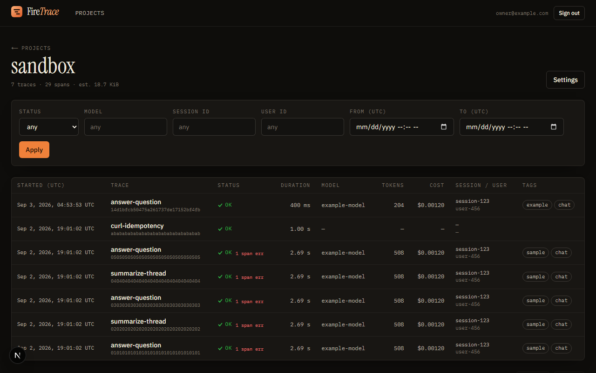
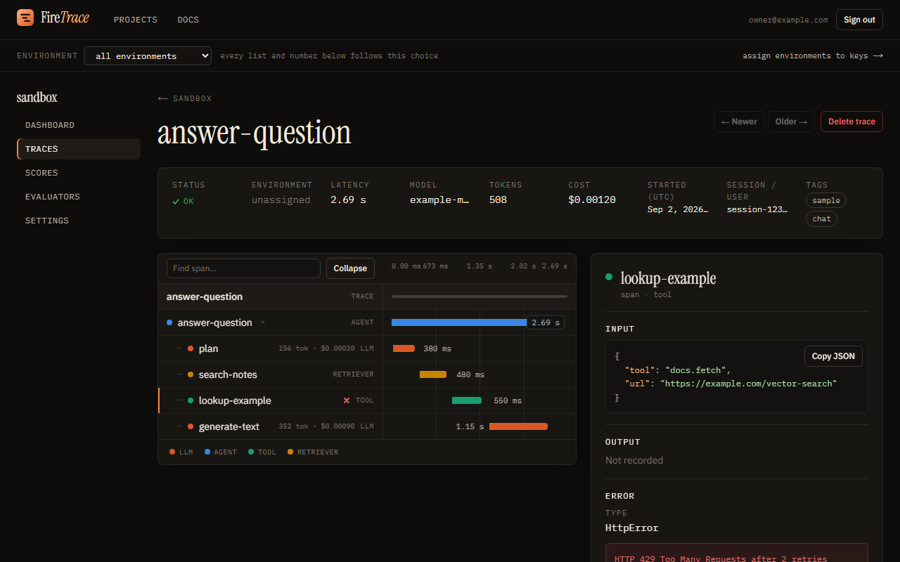
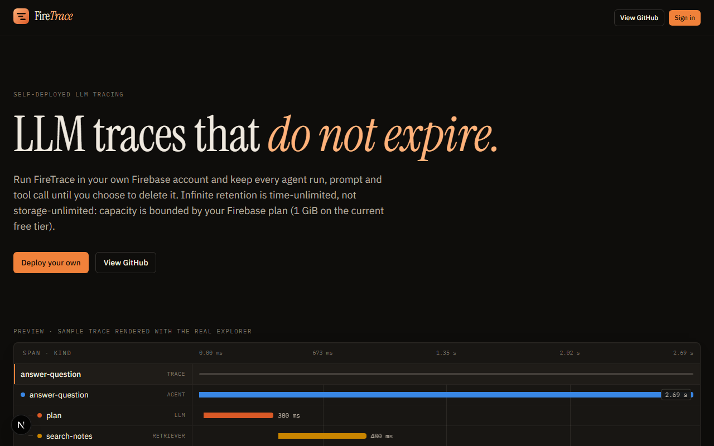
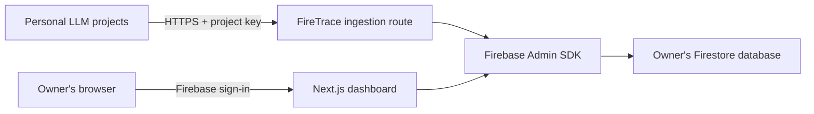

# FireTrace

FireTrace is an open-source LLM tracing app you deploy yourself: a Next.js dashboard on Vercel backed by a Firebase project that you own. Your applications send completed traces (a run of an agent, chain, or model call, with its nested spans) to an HTTP endpoint with a per-project API key; the dashboard shows a filterable trace list, a span tree and waterfall, inputs and outputs, token usage, cost, and errors.

It is built for individual developers who trace their own LLM and agent projects and want to keep that history without paying for, or being cut off by, a hosted observability service.

> **Your traces do not expire. Run FireTrace in your own Firebase account and keep history until you choose to delete it.**

## Infinite retention, precisely

Infinite retention means FireTrace never deletes data because of its age. Actual capacity is bounded by the storage quota of the owner's Firebase plan. On the current Firestore free tier, that is 1 GiB of stored data.

Concretely, the codebase has no `expireAt` field, no Firestore TTL policy, no cleanup job, and no age-based deletion path. The only ways data leaves Firestore are the explicit **Delete trace** and **Delete project** actions in the dashboard. FireTrace does not promise unlimited storage, permanent durability, or unlimited ingestion: when Firestore refuses a write because a quota is exhausted, ingestion returns an error and existing data is left untouched.

## What you get

- Multiple **projects** as trace namespaces inside one deployment.
- Per-project **API keys** (`ft_live_…`) that are shown once, stored only as an HMAC digest, and can be revoked or rotated.
- A language-neutral **ingestion API** (`POST /api/v1/traces`) that accepts one complete, immutable trace per request with idempotent retries.
- A small **TypeScript SDK** (`packages/sdk-js`) with retries, redaction, content truncation, and safe error capture.
- A **trace list** with status, model, session, user, and time-range filters, URL-backed filter state, and cursor pagination (50 per page).
- A **trace page** with a span tree and duration waterfall, an inspector (Overview, Input, Output, Attributes, Events, Error), and a canonical-JSON download.
- **Owner-only access**: Firebase sign-in, a server-verified session cookie, and an email allowlist. Firestore rules deny every direct client read and write.
- **Storage estimate** per project with warnings at 70% and 90% of a configurable allowance (default: the 1 GiB free tier).
- Local development against the Firebase Auth and Firestore emulators, with a seed script and an example trace sender.

## Preview

Screenshots from a local emulator run (`pnpm seed:emulator` data). The landing page also renders the real trace explorer with a sample trace, so the preview there is built from the same components as the dashboard.







## Architecture



One FireTrace deployment connects to one Firebase project. Inside it, `projects/{projectId}` documents provide logical namespaces.

- **All data access goes through the Firebase Admin SDK on the server** (`src/lib/firebase/admin.ts`, Node.js runtime only). The Firebase Web SDK is used in the browser for sign-in and nothing else (`src/lib/firebase/client.ts`). `firestore.rules` denies all direct client access.
- **Dashboard identity**: the login page signs in with Firebase (Google popup, or email/password with a verified address), posts the ID token to `POST /api/auth/session`, and the server verifies it, checks `DASHBOARD_ALLOWED_EMAILS`, and sets an HTTP-only session cookie (`src/lib/auth/session.ts`). Every server read re-verifies the cookie and the allowlist.
- **Ingestion**: `src/app/api/v1/traces/route.ts` authenticates the bearer key (`src/lib/firetrace/ingest.ts`), validates and normalizes the body with Zod (`src/lib/firetrace/schema.ts`, `normalize.ts`), hashes it canonically, and writes the trace, its spans, and the project counters in one Firestore transaction.

Firestore collections:

| Path                                            | Contents                                                                                                                                        |
| ----------------------------------------------- | ----------------------------------------------------------------------------------------------------------------------------------------------- |
| `projects/{projectId}`                          | name, slug, description, ownerUid, traceCount, spanCount, estimatedBytes, lastTraceAt, settings                                                 |
| `apiKeys/{keyId}`                               | projectId, label, keyHash (HMAC-SHA-256), lastFour, createdAt, createdByUid, revokedAt                                                          |
| `projects/{projectId}/traces/{traceId}`         | the normalized trace (name, status, timing, model, session, user, tags, input, output, metadata, usage, cost, counts, bodyHash, estimatedBytes) |
| `projects/{projectId}/traces/{traceId}/spans/…` | one document per span (kind, status, timing, provider, model, input, output, attributes, events, usage, cost)                                   |

Composite indexes and the single-field exemptions for large payload fields live in `firestore.indexes.json`.

## Quickstart: local emulators (about five minutes)

Prerequisites: Node.js 22 or newer (`.node-version`), pnpm 10 (`corepack enable` picks up the version pinned in `package.json`), and a Java JDK for the Firestore emulator (see the [Firebase Local Emulator Suite install docs](https://firebase.google.com/docs/emulator-suite/install_and_configure) for the required version). No Firebase account or credentials are needed for this section.

1. Install dependencies and generate the Next.js route types once:

   ```bash
   pnpm install
   pnpm typegen
   ```

2. Create `.env.local` from the template and point it at the emulators:

   ```bash
   cp .env.example .env.local
   ```

   Set these values (the Firebase Web values are placeholders; the Auth emulator does not validate them):

   ```dotenv
   NEXT_PUBLIC_FIREBASE_API_KEY=demo-api-key
   NEXT_PUBLIC_FIREBASE_AUTH_DOMAIN=localhost
   NEXT_PUBLIC_FIREBASE_PROJECT_ID=demo-firetrace
   NEXT_PUBLIC_FIREBASE_APP_ID=demo-app-id
   FIREBASE_SERVICE_ACCOUNT_BASE64=
   DASHBOARD_ALLOWED_EMAILS=
   FIRETRACE_KEY_PEPPER=local-development-pepper-not-for-production-use
   NEXT_PUBLIC_APP_URL=http://localhost:3000
   FIRETRACE_USE_EMULATORS=true
   NEXT_PUBLIC_FIRETRACE_USE_EMULATORS=true
   ```

   `FIRETRACE_KEY_PEPPER` must match the value the seed script uses to hash its sample key; the value above is the seed script's default (`scripts/seed-emulator.ts`). With `FIRETRACE_USE_EMULATORS=true` and an empty allowlist, any emulator account may sign in; this bypass is refused in production.

3. Start the emulators (Auth on 9099, Firestore on 8080, Emulator UI on 4000):

   ```bash
   pnpm emulators
   ```

4. In a second terminal, seed an owner account, a `sandbox` project, an API key, and five sample traces. The script refuses to run unless `FIRETRACE_USE_EMULATORS=true` is set in its own environment (it does not read `.env.local`):

   ```bash
   FIRETRACE_USE_EMULATORS=true pnpm seed:emulator
   ```

   PowerShell: `$env:FIRETRACE_USE_EMULATORS="true"; pnpm seed:emulator`

   It prints the owner credentials (`owner@example.com` / `firetrace-dev-password`) and a plaintext `ft_live_…` key.

5. In a third terminal, start the app and sign in:

   ```bash
   pnpm dev
   ```

   Open <http://localhost:3000/login>, sign in with the seeded email and password (or use the Google button, which the Auth emulator answers with a fake account picker), and open the `sandbox` project.

6. Send a nested example trace (agent root, tool span, LLM span) through the SDK:

   ```bash
   FIRETRACE_ENDPOINT=http://localhost:3000 FIRETRACE_API_KEY=ft_live_... pnpm trace:example
   ```

   The script prints the URL of the stored trace.

7. Run the checks:

   ```bash
   pnpm typecheck && pnpm lint && pnpm test
   pnpm test:integration   # runs vitest inside firebase emulators:exec
   ```

`GET /api/health` reports configuration booleans (`firebaseConfigured`, `authConfigured`, `ingestConfigured`, `emulators`) and, outside production, the list of problems.

## Deploy your own

Two guides cover the full path from an empty Firebase project to a working Vercel deployment:

1. [docs/firebase-setup.md](docs/firebase-setup.md): create the Firebase project and Web app, create the Firestore database, enable Google sign-in and authorized domains, deploy `firestore.rules` and `firestore.indexes.json`, generate the Admin service-account credential, and pick the allowlisted email.
2. [docs/vercel-deployment.md](docs/vercel-deployment.md): import the repository, set environment variables per environment, add custom domains, sign in for the first time, and run the smoke test.

Environment variables (see `.env.example` for comments):

| Variable                           | Scope   | Purpose                                                                                          |
| ---------------------------------- | ------- | ------------------------------------------------------------------------------------------------ |
| `NEXT_PUBLIC_FIREBASE_API_KEY`     | browser | Firebase Web app config for sign-in                                                              |
| `NEXT_PUBLIC_FIREBASE_AUTH_DOMAIN` | browser | Firebase Web app config for sign-in                                                              |
| `NEXT_PUBLIC_FIREBASE_PROJECT_ID`  | both    | Firebase project id                                                                              |
| `NEXT_PUBLIC_FIREBASE_APP_ID`      | browser | Firebase Web app config for sign-in                                                              |
| `FIREBASE_SERVICE_ACCOUNT_BASE64`  | server  | Service-account JSON, base64-encoded; required in production                                     |
| `DASHBOARD_ALLOWED_EMAILS`         | server  | Comma-separated owner emails; required in production                                             |
| `FIRETRACE_KEY_PEPPER`             | server  | Random secret (32+ characters) used to HMAC API keys; changing it invalidates every existing key |
| `NEXT_PUBLIC_APP_URL`              | both    | Canonical deployment origin, used for Origin checks and copyable snippets                        |
| `FIRETRACE_STORAGE_LIMIT_BYTES`    | server  | Optional; storage-warning allowance, default 1 GiB                                               |

Do not set `FIRETRACE_USE_EMULATORS` or `NEXT_PUBLIC_FIRETRACE_USE_EMULATORS` to `true` on a hosted deployment; production refuses to start with the emulator flag enabled.

[](<https://vercel.com/new/clone?repository-url=https%3A%2F%2Fgithub.com%2FIdkwhatImD0ing%2FFireTrace&env=NEXT_PUBLIC_FIREBASE_API_KEY,NEXT_PUBLIC_FIREBASE_AUTH_DOMAIN,NEXT_PUBLIC_FIREBASE_PROJECT_ID,NEXT_PUBLIC_FIREBASE_APP_ID,FIREBASE_SERVICE_ACCOUNT_BASE64,DASHBOARD_ALLOWED_EMAILS,FIRETRACE_KEY_PEPPER,NEXT_PUBLIC_APP_URL&envDescription=Firebase%20Web%20app%20config%2C%20Admin%20service%20account%20(base64)%2C%20allowlisted%20emails%2C%20key%20pepper%2C%20public%20URL&envLink=https%3A%2F%2Fgithub.com%2FIdkwhatImD0ing%2FFireTrace%2Fblob%2Fmain%2Fdocs%2Fvercel-deployment.md&project-name=firetrace&repository-name=firetrace>)

The button clones the repository into your Vercel account and prompts for the variables in the table above. It cannot configure Firebase for you: complete [docs/firebase-setup.md](docs/firebase-setup.md) first, then paste the values when Vercel asks.

## Send traces

Create a project in the dashboard, open **Settings**, create an API key, and copy it when it is shown. The project page also has a setup panel with the endpoint, a redacted key reference, and both snippets below with your deployment URL filled in.

### TypeScript SDK

```ts
import { FireTrace } from "@firetrace/sdk";

const client = new FireTrace({
  endpoint: process.env.FIRETRACE_ENDPOINT!, // https://your-deployment.example
  apiKey: process.env.FIRETRACE_API_KEY!, // ft_live_...
});

const trace = client.startTrace("answer-question", {
  sessionId: "session-123",
  input: { prompt },
});

const span = trace.startSpan("generate-text", {
  kind: "llm",
  provider: "example-provider",
  model: "example-model",
  input: { messages },
});

try {
  const result = await callModel();
  span.end({ status: "ok", output: { text: result.text }, usage: result.usage });
  await trace.end({ status: "ok", output: { text: result.text } });
} catch (error) {
  span.end({ status: "error", error });
  await trace.end({ status: "error", error });
  throw error;
}

await client.shutdown(); // wait for in-flight sends before the process exits
```

`trace.end()` never throws unless you pass `throwOnError: true`; failures are reported through `onError` and returned as `{ ok: false, error }`. See [packages/sdk-js/README.md](packages/sdk-js/README.md) for the options table and the retry, redaction, and truncation rules.

### curl

```bash
curl -X POST https://your-deployment.example/api/v1/traces \
  -H "Authorization: Bearer $FIRETRACE_API_KEY" \
  -H "Content-Type: application/json" \
  -d '{
    "schemaVersion": 1,
    "trace": {
      "id": "42f38ac8295345a7a12c4e3f60d6da23",
      "name": "answer-question",
      "status": "ok",
      "startedAt": "2026-09-02T19:01:02.120Z",
      "endedAt": "2026-09-02T19:01:04.812Z",
      "model": "example-model",
      "spans": [
        { "id": "00f067aa0ba902b7", "parentSpanId": null, "name": "answer-question", "kind": "agent",
          "status": "ok", "startedAt": "2026-09-02T19:01:02.120Z", "endedAt": "2026-09-02T19:01:04.812Z" },
        { "id": "b7ad6b7169203331", "parentSpanId": "00f067aa0ba902b7", "name": "generate-text", "kind": "llm",
          "status": "ok", "model": "example-model",
          "startedAt": "2026-09-02T19:01:02.350Z", "endedAt": "2026-09-02T19:01:04.600Z",
          "usage": { "inputTokens": 120, "outputTokens": 84, "totalTokens": 204 } }
      ]
    }
  }'
```

Trace ids are 32 lowercase hex characters and span ids are 16; generate fresh random ids per run. A new trace returns `201`, an identical retry returns `200` with `"duplicate": true`, and the same id with different content returns `409`. The complete field reference, limits, and error codes are in [docs/ingestion-api.md](docs/ingestion-api.md).

## Repository layout

```text
src/app/                      Next.js App Router: landing, (auth)/login, (dashboard)/projects/..., api/
src/app/api/v1/traces/        POST ingestion route
src/app/api/auth/session/     POST (sign-in) and DELETE (sign-out) session cookie
src/app/api/health/           configuration booleans
src/app/api/projects/[projectId]/traces/[traceId]/export/   owner-only canonical JSON download
src/components/               UI (auth, dashboard shell, projects, settings, trace explorer, primitives)
src/lib/env/                  server.ts (fail-closed server config), client.ts (browser config)
src/lib/firebase/             admin.ts (Admin SDK, server-only), client.ts (Web SDK, sign-in only)
src/lib/auth/                 session.ts (cookie + allowlist), origin.ts (Origin check)
src/lib/firetrace/            schema, normalize, hash, ids, tree, api-keys, ingest, projects, queries, storage, sample
src/lib/actions.ts            server actions for dashboard mutations
packages/sdk-js/              @firetrace/sdk (TypeScript, Node 22+)
scripts/                      seed-emulator.ts, send-example-trace.ts
tests/                        vitest unit (tests/unit) and emulator-backed integration (tests/integration) tests, server-only mock
docs/                         firebase-setup, vercel-deployment, ingestion-api, security
firebase.json                 emulator ports, Auth provider config, rules/indexes paths
firestore.rules               deny all direct client access
firestore.indexes.json        composite indexes and payload-field exemptions
```

## Commands

| Command                 | What it does                                                                                        |
| ----------------------- | --------------------------------------------------------------------------------------------------- |
| `pnpm dev`              | Next.js dev server on <http://localhost:3000>                                                       |
| `pnpm build`            | Production build                                                                                    |
| `pnpm typegen`          | Generate Next.js route types (`PageProps`, `RouteContext`); run once after cloning or adding routes |
| `pnpm typecheck`        | `tsc --noEmit`                                                                                      |
| `pnpm lint`             | ESLint                                                                                              |
| `pnpm format`           | Prettier (write); `pnpm format:check` to verify                                                     |
| `pnpm test`             | Vitest unit project (`tests/unit`, `packages/*/src`)                                                |
| `pnpm test:integration` | Vitest integration project inside `firebase emulators:exec` (needs Java)                            |
| `pnpm test:e2e`         | Playwright browser tests                                                                            |
| `pnpm emulators`        | Start the Auth and Firestore emulators for project `demo-firetrace`                                 |
| `pnpm seed:emulator`    | Seed owner, project, key, and sample traces (requires `FIRETRACE_USE_EMULATORS=true`)               |
| `pnpm trace:example`    | Send a nested example trace with the SDK (`FIRETRACE_ENDPOINT`, `FIRETRACE_API_KEY`)                |
| `pnpm firebase:deploy`  | Deploy Firestore rules and indexes and the Auth provider config from `firebase.json`                |
| `pnpm sdk:build`        | Compile `packages/sdk-js` to `dist/`; `pnpm sdk:typecheck` to check only                            |

## Current limitations

- One deployment serves one Firebase project. Every email in `DASHBOARD_ALLOWED_EMAILS` is a co-owner with access to every project; there are no per-project human permissions, invitations, or roles.
- Traces are complete and immutable. There is no streaming or partial-trace update; re-sending a trace id with different content is rejected with `409`.
- Limits per trace: 200 spans, 50 events per span, 20 tags, a 2 MiB request body, and 750 KiB per stored document (see `docs/ingestion-api.md`).
- Filters are exact matches on status, model, session id, and user id plus a time range. There is no full-text search over prompts or responses.
- No native OTLP ingestion and no Python, Go, or Java SDK; non-JavaScript applications use the HTTP API directly.
- No built-in price tables: `costUsd` is whatever the caller supplies.
- No application-level rate limiting. `429` is returned only when Firestore reports an exhausted quota.
- The project setting `settings.captureContent` is stored (always `true`) but not enforced by the ingestion path; control content capture in the caller, for example with the SDK's `redact` and `maxContentBytes` options or by not sending `input`/`output`.
- Project deletion walks every trace and span in one server action; very large projects may need the action to be run more than once.
- Firebase Auth email/password accounts can be created by anyone who reaches the login page, but they cannot open the dashboard unless the verified email is on the allowlist.

## Data and privacy model

- You own the Firebase project. FireTrace has no hosted component, no telemetry, and no third-party data flow: traces go from your application to your Vercel deployment to your Firestore database.
- FireTrace stores what you send. `input`, `output`, `metadata`, `attributes`, and `events` are stored verbatim and rendered as escaped text in the dashboard. Redact before sending: do not capture credentials, access tokens, or regulated personal data (health, financial, or similar) unless your Firebase project and Vercel account are governed by controls appropriate for that data.
- The server never logs trace content, authorization headers, cookies, or key material (`src/lib/log.ts` strips those keys); logs contain request ids, project and trace ids, counts, and error codes.
- Only allowlisted, verified emails can read anything. The Admin credential lives only in server environment variables and is decoded in memory.
- Deleting a trace removes its span documents; deleting a project removes its traces, spans, and API keys. Both are explicit, typed-confirmation actions. Firestore backups, if you configure them, are outside FireTrace's control.
- `estimatedBytes` is FireTrace's own serialized-size estimate, not Firebase's billable storage measurement.

## Free tier disclaimer

FireTrace's storage warnings default to the Firestore free-tier allowance of 1 GiB at the time of writing, adjustable with `FIRETRACE_STORAGE_LIMIT_BYTES`. Firebase quotas and prices change; the authoritative numbers, including daily read/write limits that also apply to the dashboard and ingestion, are on the [Cloud Firestore pricing page](https://firebase.google.com/docs/firestore/pricing). Exceeding a quota causes Firestore to refuse writes until the quota resets or the plan is upgraded; FireTrace never deletes data to make room.

## Contributing, security, license

- Contributions: [CONTRIBUTING.md](CONTRIBUTING.md)
- Security policy and vulnerability reporting: [SECURITY.md](SECURITY.md); threat model and checklist: [docs/security.md](docs/security.md)
- License: [MIT](LICENSE)
