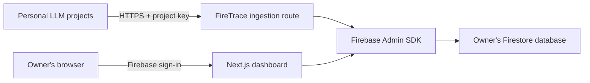

# FireTrace

FireTrace is an open-source LLM tracing app you deploy yourself: a Next.js dashboard on Vercel backed by a Firebase project that you own. Your applications send completed traces (a run of an agent, chain, or model call, with its nested spans) to an HTTP endpoint with a per-project API key; the dashboard shows a filterable trace list, a span tree and waterfall, inputs and outputs, token usage, cost, and errors.

It is built for individual developers who trace their own LLM and agent projects and want to keep that history without paying for, or being cut off by, a hosted observability service.

> **Your traces do not expire. Run FireTrace in your own Firebase account and keep history until you choose to delete it.**

## Infinite retention, precisely

Infinite retention means FireTrace never deletes data because of its age. Actual capacity is bounded by the storage quota of the owner's Firebase plan. On the current Firestore free tier, that is 1 GiB of stored data.

Concretely, the codebase has no `expireAt` field, no Firestore TTL policy, no cleanup job, and no age-based deletion path. The only ways data leaves Firestore are the explicit **Delete trace** and **Delete project** actions in the dashboard. FireTrace does not promise unlimited storage, permanent durability, or unlimited ingestion: when Firestore refuses a write because a quota is exhausted, ingestion returns an error and existing data is left untouched.

## What you get

- Multiple **projects** as trace namespaces inside one deployment.
- Per-project **API keys** (`ft_live_…`) that are shown once, stored only as an HMAC digest, carry **scopes** (`traces:write`, `traces:read`, `traces:delete`) and an optional expiry, and can be revoked or rotated.
- A language-neutral **REST API** ([docs/api.md](docs/api.md), OpenAPI at `/api/v1/openapi.json`): `POST /api/v1/traces` records one complete trace with idempotent retries; `PATCH /api/v1/traces/{id}` merges keys into that trace's `metadata`, the one mutable part, so ratings and evaluations that arrive after the run have somewhere to go; `GET` routes list and read traces and the project; `DELETE` removes a trace explicitly.
- An **MCP server** ([docs/mcp.md](docs/mcp.md)) so AI agents can list, inspect, record, annotate, and delete traces: a remote endpoint at `/api/mcp` on every deployment plus a stdio bridge (`packages/mcp-server`, `@firetrace/mcp`). Tools follow the key's scopes.
- A small **TypeScript SDK** (`packages/sdk-js`) with retries, redaction, content truncation, safe error capture, and a read client for the API that also patches trace metadata.
- A **trace list** with status, model, session, user, and time-range filters, URL-backed filter state, and cursor pagination (50 per page).
- A **trace page** with a span tree and duration waterfall, an inspector (Overview, Input, Output, Attributes, Events, Error), and a canonical-JSON download.
- **Owner-only access**: Firebase sign-in, a server-verified session cookie, and an email allowlist. Firestore rules deny every direct client read and write.
- **Storage estimate** per project with warnings at 70% and 90% of a configurable allowance (default: the 1 GiB free tier).
- Local development against the Firebase Auth and Firestore emulators, with a seed script and an example trace sender.

## Preview

Screenshots from a local emulator run (`pnpm seed:emulator` data). The landing page also renders the real trace explorer with a sample trace, so the preview there is built from the same components as the dashboard.


## Architecture



One FireTrace deployment connects to one Firebase project. Inside it, `projects/{projectId}` documents provide logical namespaces.

- **All data access goes through the Firebase Admin SDK on the server** (`src/lib/firebase/admin.ts`, Node.js runtime only). The Firebase Web SDK is used in the browser for sign-in and nothing else (`src/lib/firebase/client.ts`). `firestore.rules` denies all direct client access.
- **Dashboard identity**: the login page signs in with Firebase (Google popup, or email/password with a verified address), posts the ID token to `POST /api/auth/session`, and the server verifies it, checks `DASHBOARD_ALLOWED_EMAILS`, and sets an HTTP-only session cookie (`src/lib/auth/session.ts`). Every server read re-verifies the cookie and the allowlist.
- **API**: every `/api/v1` route and `/api/mcp` runs through `withApiKey` (`src/lib/firetrace/api-handler.ts`), which resolves the bearer key to a project and its scopes (`api-auth.ts`) and rejects missing scopes with `403 insufficient_scope`. Ingestion validates and normalizes the body with Zod (`src/lib/firetrace/schema.ts`, `normalize.ts`), hashes it canonically, and writes the trace, its spans, and the project counters in one Firestore transaction (`ingest.ts`). The MCP endpoint builds a stateless server per request over the same code paths (`src/lib/mcp/firestore-backend.ts`, `packages/mcp-server`).

Firestore collections:

| Path                                            | Contents                                                                                                                                                           |
| ----------------------------------------------- | ------------------------------------------------------------------------------------------------------------------------------------------------------------------ |
| `projects/{projectId}`                          | name, slug, description, ownerUid, traceCount, spanCount, estimatedBytes, lastTraceAt, settings                                                                    |
| `apiKeys/{keyId}`                               | projectId, label, keyHash (HMAC-SHA-256), lastFour, scopes, expiresAt, lastUsedAt, createdAt, createdByUid, revokedAt                                              |
| `projects/{projectId}/traces/{traceId}`         | the normalized trace (name, status, timing, model, session, user, tags, input, output, metadata, metadataUpdatedAt, usage, cost, counts, bodyHash, estimatedBytes) |
| `projects/{projectId}/traces/{traceId}/spans/…` | one document per span (kind, status, timing, provider, model, input, output, attributes, events, usage, cost)                                                      |

Composite indexes and the single-field exemptions for large payload fields live in `firestore.indexes.json`.

## Quickstart: local emulators (about five minutes)

Prerequisites: Node.js 22 or newer (`.node-version`), pnpm 10 (`corepack enable` picks up the version pinned in `package.json`; Node 25 and newer no longer bundle Corepack, so there run `npm install -g pnpm@10` instead), and a Java JDK for the Firestore emulator (see the [Firebase Local Emulator Suite install docs](https://firebase.google.com/docs/emulator-suite/install_and_configure) for the required version). No Firebase account or credentials are needed for this section.

1. Install dependencies and generate the Next.js route types once:

   ```bash
   pnpm install
   pnpm typegen
   ```

2. Create `.env.local` from the template and point it at the emulators:

   ```bash
   cp .env.example .env.local
   ```

   Set these values (the Firebase Web values are placeholders; the Auth emulator does not validate them):

   ```dotenv
   NEXT_PUBLIC_FIREBASE_API_KEY=demo-api-key
   NEXT_PUBLIC_FIREBASE_AUTH_DOMAIN=localhost
   NEXT_PUBLIC_FIREBASE_PROJECT_ID=demo-firetrace
   NEXT_PUBLIC_FIREBASE_APP_ID=demo-app-id
   FIREBASE_SERVICE_ACCOUNT_BASE64=
   DASHBOARD_ALLOWED_EMAILS=
   FIRETRACE_KEY_PEPPER=local-development-pepper-not-for-production-use
   NEXT_PUBLIC_APP_URL=http://localhost:3000
   FIRETRACE_USE_EMULATORS=true
   NEXT_PUBLIC_FIRETRACE_USE_EMULATORS=true
   ```

   `FIRETRACE_KEY_PEPPER` must match the value the seed script uses to hash its sample key; the value above is the seed script's default (`scripts/seed-emulator.ts`). With `FIRETRACE_USE_EMULATORS=true` and an empty allowlist, any emulator account may sign in; this bypass is refused in production.

3. Start the emulators (Auth on 9099, Firestore on 8080, Emulator UI on 4000):

   ```bash
   pnpm emulators
   ```

4. In a second terminal, seed an owner account, a `sandbox` project, an API key, and five sample traces. The script refuses to run unless `FIRETRACE_USE_EMULATORS=true` is set in its own environment (it does not read `.env.local`):

   ```bash
   FIRETRACE_USE_EMULATORS=true pnpm seed:emulator
   ```

   PowerShell: `$env:FIRETRACE_USE_EMULATORS="true"; pnpm seed:emulator`

   It prints the owner credentials (`owner@example.com` / `firetrace-dev-password`) and a plaintext `ft_live_…` key.

5. In a third terminal, start the app and sign in:

   ```bash
   pnpm dev
   ```

   Open <http://localhost:3000/login>, sign in with the seeded email and password (or use the Google button, which the Auth emulator answers with a fake account picker), and open the `sandbox` project.

6. Send a nested example trace (agent root, tool span, LLM span) through the SDK:

   ```bash
   FIRETRACE_ENDPOINT=http://localhost:3000 FIRETRACE_API_KEY=ft_live_... pnpm trace:example
   ```

   The script prints the URL of the stored trace.

7. Run the checks:

   ```bash
   pnpm typecheck && pnpm lint && pnpm test
   pnpm test:integration   # runs vitest inside firebase emulators:exec
   ```

`GET /api/health` reports configuration booleans (`firebaseConfigured`, `authConfigured`, `ingestConfigured`, `emulators`) and, outside production, the list of problems.

## Deploy your own

Every deployment also serves these guides at `/docs` (for the author's instance: <https://tracing.art3m1s.me/docs>), rendered from the same Markdown files.

Two guides cover the full path from an empty Firebase project to a working Vercel deployment:

1. [docs/firebase-setup.md](docs/firebase-setup.md): create the Firebase project and Web app, create the Firestore database, enable Google sign-in and authorized domains, deploy `firestore.rules` and `firestore.indexes.json`, generate the Admin service-account credential, and pick the allowlisted email.
2. [docs/vercel-deployment.md](docs/vercel-deployment.md): import the repository, set environment variables per environment, add custom domains, sign in for the first time, and run the smoke test.

### Let an AI agent deploy it

If you use a coding agent that can run commands on your machine (Claude Code, Codex CLI, Cursor, Gemini CLI, …), paste the prompt below and it will work through both guides, stopping only for the browser sign-ins and the steps that need your consent. You need Node.js 22+, git, a Google account, and a Vercel account; no paid plan. The same prompt lives in [docs/deploy-prompt.md](docs/deploy-prompt.md), so `Fetch https://raw.githubusercontent.com/IdkwhatImD0ing/FireTrace/main/docs/deploy-prompt.md and follow it` also works.

<details>
<summary><strong>Deployment prompt</strong> (expand, then use the copy button)</summary>

```text
Deploy FireTrace for me. FireTrace is an open-source, self-hosted LLM/agent tracing app: a Next.js dashboard on Vercel backed by a Firebase project (Firestore + Authentication) that I own. Repository: https://github.com/IdkwhatImD0ing/FireTrace. Its docs/firebase-setup.md and docs/vercel-deployment.md are the source of truth; this prompt is the checklist. Work in my terminal and report progress after each numbered step. Commands are written for bash/zsh; where PowerShell differs a PowerShell form follows. Run one command per line rather than chaining with && (Windows PowerShell 5.1 rejects it).

GROUND RULES
- Ask me before anything that costs money and before any destructive or irreversible action (deleting projects or databases, rotating secrets, force-pushing).
- Never commit secrets. .env.local and .firebaserc are gitignored; service-account key files are ignored only when their name contains "service-account" or "-firebase-adminsdk-", so keep the key outside the repository (../firetrace-service-account.json) and never copy it into the clone. Never paste the service-account JSON, its base64 form, or the key pepper into this chat, and never run a command that prints them to the terminal; the recipes below write them straight into files. Refer to them by name only.
- Use `npx -y firebase-tools@latest` (never a bare `firebase`), the Vercel CLI (`npm i -g vercel` if missing), and pnpm inside the repo (never npm or yarn for the repo itself).
- Stop and ask me when a step needs a browser: CLI sign-ins, OAuth consent screens, console-only actions, or downloading a service-account key. Do not try to automate sign-in.
- Do not enable any Firestore TTL policy, scheduled cleanup, or age-based deletion; infinite retention is the point of this app.

INPUTS (ask me for any that are missing before you start)
- FIREBASE_PROJECT_ID: a new, globally unique, lowercase Firebase project id (letters, digits, hyphens).
- OWNER_EMAIL: the Google account email that will sign in to the dashboard. It becomes the allowlist and the OAuth support email.
- FIRESTORE_LOCATION: a Firestore location such as nam5, us-east1, or eur3. It cannot be changed later.
- VERCEL_PROJECT_NAME (optional, default firetrace): lowercase letters, digits, '.', '_' or '-' only, no '---', at most 100 characters. It is also the clone folder and the default hostname <name>.vercel.app.
- VERCEL_TEAM (optional): the Vercel team slug to create the project in, if my account belongs to more than one team.
- REPO_URL (optional): my fork of the repository if I have one; otherwise clone the upstream repository.

STEPS
1. Prepare the repository.
   git clone <REPO_URL or https://github.com/IdkwhatImD0ing/FireTrace.git> <VERCEL_PROJECT_NAME>
   cd <VERCEL_PROJECT_NAME>
   Confirm `node --version` is 22 or newer. Make pnpm 10 available: `corepack enable`; if corepack is not found (Node 25 and newer no longer bundle it) or fails with EPERM on Windows, run `npm install -g pnpm@10` instead. Then: pnpm install; pnpm typegen. Copy .env.example to .env.local and .firebaserc.example to .firebaserc (cp on macOS/Linux, Copy-Item on PowerShell). Put FIREBASE_PROJECT_ID into .firebaserc in place of "your-firebase-project-id".

2. Create the Firebase project.
   Firebase CLI sign-in cannot complete from an agent shell (the CLI switches to a non-interactive flow that needs a code typed back). Ask me to run `npx -y firebase-tools@latest login` in my own terminal and tell you when it is done; the credential is stored in the CLI's global config and your later commands use it. Check with: npx -y firebase-tools@latest login:list
   npx -y firebase-tools@latest projects:create <FIREBASE_PROJECT_ID> --display-name "FireTrace"
   If the id is taken, ask me for another one. Google Analytics is not needed.

3. Register the Web app and capture its public config.
   npx -y firebase-tools@latest apps:create WEB "FireTrace Web" --project <FIREBASE_PROJECT_ID>
   npx -y firebase-tools@latest apps:sdkconfig WEB <APP_ID printed above> --project <FIREBASE_PROJECT_ID>
   Write apiKey, authDomain, projectId, and appId into .env.local as NEXT_PUBLIC_FIREBASE_API_KEY, NEXT_PUBLIC_FIREBASE_AUTH_DOMAIN, NEXT_PUBLIC_FIREBASE_PROJECT_ID, NEXT_PUBLIC_FIREBASE_APP_ID. These four are public browser config, not secrets, so editing the file directly is fine.

4. Create the Firestore database and pin its location.
   npx -y firebase-tools@latest firestore:databases:create "(default)" --location <FIRESTORE_LOCATION> --edition standard --project <FIREBASE_PROJECT_ID>
   Also add "location": "<FIRESTORE_LOCATION>" inside the "firestore" block of firebase.json, next to "rules" and "indexes": step 6 would otherwise create a missing (default) database in nam5, and a database location can never be changed.
   Alternatives if the command is unavailable or I prefer: with gcloud (`gcloud auth login`), run `gcloud services enable firestore.googleapis.com --project=<FIREBASE_PROJECT_ID>` and then `gcloud firestore databases create --location=<FIRESTORE_LOCATION> --type=firestore-native --edition=standard --project=<FIREBASE_PROJECT_ID>`; or ask me to create it in the Firebase console (Build > Firestore Database > Create database > Standard edition > Native mode > production rules).

5. Configure the sign-in providers.
   In firebase.json set the "auth" block to providers only: providers.emailPassword = true, providers.googleSignIn.oAuthBrandDisplayName = "FireTrace", providers.googleSignIn.supportEmail = OWNER_EMAIL. Remove any "authorizedDomains" key if one is present: the CLI does not manage authorized domains (that is step 10). The committed file may still hold the original author's support email; replace it.
   npx -y firebase-tools@latest deploy --only auth --project <FIREBASE_PROJECT_ID>
   If the CLI rejects the auth target, ask me to enable Google and Email/Password under Build > Authentication > Sign-in method in the console, with OWNER_EMAIL as the support email.

6. Deploy Firestore rules and indexes (deny-all rules; the app reads and writes only through the Admin SDK on the server). This also creates the database from step 4 when it does not exist.
   npx -y firebase-tools@latest deploy --only firestore --project <FIREBASE_PROJECT_ID>
   Verify the location: npx -y firebase-tools@latest firestore:databases:list --project <FIREBASE_PROJECT_ID> must show (default) at FIRESTORE_LOCATION. Composite indexes take a few minutes to build; you do not need to wait.

7. Create the Admin SDK service-account credential.
   Preferred, with gcloud: gcloud iam service-accounts list --project <FIREBASE_PROJECT_ID> to find the account named like firebase-adminsdk-xxxxx@<FIREBASE_PROJECT_ID>.iam.gserviceaccount.com, then
   gcloud iam service-accounts keys create ../firetrace-service-account.json --iam-account=<that email> --project <FIREBASE_PROJECT_ID>
   Without gcloud (or if key creation is blocked by an organization policy): ask me to download a key from Project settings > Service accounts > Firebase Admin SDK > Generate new private key and save it as ../firetrace-service-account.json (outside the repository).
   Write it into .env.local as one base64 line without printing it, on any platform:
   node -e "const fs=require('fs');const b=fs.readFileSync(process.argv[1]).toString('base64');const p='.env.local';fs.writeFileSync(p,fs.readFileSync(p,'utf8').replace(/^FIREBASE_SERVICE_ACCOUNT_BASE64=[^\r\n]*/m,'FIREBASE_SERVICE_ACCOUNT_BASE64='+b))" ../firetrace-service-account.json
   (Manual equivalents that print to stdout, only if I ask: Linux `base64 -w0 <file>`, macOS `base64 -i <file> | tr -d '\n'`.)

8. Fill in the remaining .env.local values.
   DASHBOARD_ALLOWED_EMAILS=<OWNER_EMAIL>
   FIRETRACE_KEY_PEPPER: generate a random secret straight into the file, without printing it:
   node -e "const fs=require('fs');const p='.env.local';const s=require('crypto').randomBytes(48).toString('base64');fs.writeFileSync(p,fs.readFileSync(p,'utf8').replace(/^FIRETRACE_KEY_PEPPER=[^\r\n]*/m,'FIRETRACE_KEY_PEPPER='+s))"
   Tell me to store the pepper somewhere safe (it is in .env.local): changing it later invalidates every API key.
   NEXT_PUBLIC_APP_URL=http://localhost:3000
   FIRETRACE_USE_EMULATORS=false and NEXT_PUBLIC_FIRETRACE_USE_EMULATORS=false
   Leave FIRETRACE_STORAGE_LIMIT_BYTES unset (optional storage-warning allowance in bytes; the default is the 1 GiB free tier). Leave FIRETRACE_TRIAL_TRACE_LIMIT unset unless I say I want strangers to be able to sign in and try a few traces on my instance.
   Then verify locally: start `pnpm dev` in the background, GET http://localhost:3000/api/health (curl on macOS/Linux; Invoke-RestMethod on PowerShell) and confirm firebaseConfigured, authConfigured, and ingestConfigured are all true (the response lists any problems outside production). If port 3000 is busy, use `pnpm exec next dev --port 3001` and adjust the URL. Afterwards stop the dev server and make sure nothing still listens on the port: macOS/Linux `lsof -ti :3000 | xargs kill`; PowerShell `Get-NetTCPConnection -LocalPort 3000 -State Listen | ForEach-Object { Stop-Process -Id $_.OwningProcess -Force }`.

9. Create the Vercel project and set its environment variables (Production environment).
   Ask me to run `vercel login` in my own terminal (it is a device-code flow that blocks until I approve it in the browser) and tell you when it is done; the token is stored in the CLI's global config. Check with: vercel whoami
   vercel link --yes --project <VERCEL_PROJECT_NAME>     (run from the repository root; the CLI runs non-interactively for agents and needs --project; it creates the project if it does not exist. Add --scope <VERCEL_TEAM> when I gave you a team; if the CLI answers missing_scope, ask me for the team slug and retry with --scope.)
   Non-secret values, one command each: vercel env add <NAME> production --value "<value>" --no-sensitive --yes
     NEXT_PUBLIC_FIREBASE_API_KEY, NEXT_PUBLIC_FIREBASE_AUTH_DOMAIN, NEXT_PUBLIC_FIREBASE_PROJECT_ID, NEXT_PUBLIC_FIREBASE_APP_ID, DASHBOARD_ALLOWED_EMAILS, NEXT_PUBLIC_APP_URL (use https://<VERCEL_PROJECT_NAME>.vercel.app for now)
   The two secrets, FIREBASE_SERVICE_ACCOUNT_BASE64 and FIRETRACE_KEY_PEPPER, are piped from .env.local on stdin so the value never appears in a command line, a process list, or the chat:
     bash/zsh:  grep '^FIRETRACE_KEY_PEPPER=' .env.local | cut -d= -f2- | vercel env add FIRETRACE_KEY_PEPPER production --sensitive --yes
     PowerShell: ((Get-Content .env.local) -match '^FIRETRACE_KEY_PEPPER=')[0] -replace '^FIRETRACE_KEY_PEPPER=','' | vercel env add FIRETRACE_KEY_PEPPER production --sensitive --yes
     and the same two forms with FIREBASE_SERVICE_ACCOUNT_BASE64. Afterwards `vercel env ls production` must list all eight names. Production values are sensitive by default in current CLIs; --sensitive makes it explicit, and sensitive values can never be read back. If the CLI rejects --sensitive, add them without it and tell me to mark them Sensitive in the Vercel dashboard.
   Do not set FIRETRACE_USE_EMULATORS, NEXT_PUBLIC_FIRETRACE_USE_EMULATORS, or the emulator host variables; production refuses to start with the emulator flag on. Preview environments are optional and share the same Firestore unless given their own Firebase project; skip them unless I ask.

10. Deploy and authorize the hostname for sign-in.
   vercel deploy --prod --yes. The output has two URLs: the `Production:` line is a per-deployment URL that changes every deploy; the `Aliased:` line is the stable hostname (<name>.vercel.app). Use the stable hostname everywhere below. If it differs from the NEXT_PUBLIC_APP_URL you set, update that variable (vercel env rm NEXT_PUBLIC_APP_URL production --yes, then add it again with --no-sensitive) and deploy again.
   Firebase only completes sign-in on hostnames in its authorized-domains list, and the Firebase CLI cannot edit that list, so add the Vercel hostname now, one of these ways:
   - With gcloud: read the current list, then write it back with the new hostname appended (the body replaces the whole list; keep localhost, <FIREBASE_PROJECT_ID>.firebaseapp.com and <FIREBASE_PROJECT_ID>.web.app).
     bash/zsh:  curl -s -H "Authorization: Bearer $(gcloud auth print-access-token)" -H "x-goog-user-project: <FIREBASE_PROJECT_ID>" https://identitytoolkit.googleapis.com/admin/v2/projects/<FIREBASE_PROJECT_ID>/config
                curl -s -X PATCH "https://identitytoolkit.googleapis.com/admin/v2/projects/<FIREBASE_PROJECT_ID>/config?updateMask=authorizedDomains" -H "Authorization: Bearer $(gcloud auth print-access-token)" -H "x-goog-user-project: <FIREBASE_PROJECT_ID>" -H "Content-Type: application/json" -d '{"authorizedDomains":["localhost","<FIREBASE_PROJECT_ID>.firebaseapp.com","<FIREBASE_PROJECT_ID>.web.app","<hostname>"]}'
     PowerShell: $h=@{Authorization="Bearer $(gcloud auth print-access-token)";'x-goog-user-project'='<FIREBASE_PROJECT_ID>'}
                Invoke-RestMethod -Headers $h https://identitytoolkit.googleapis.com/admin/v2/projects/<FIREBASE_PROJECT_ID>/config
                Invoke-RestMethod -Method Patch -Headers $h -ContentType 'application/json' -Body '{"authorizedDomains":["localhost","<FIREBASE_PROJECT_ID>.firebaseapp.com","<FIREBASE_PROJECT_ID>.web.app","<hostname>"]}' 'https://identitytoolkit.googleapis.com/admin/v2/projects/<FIREBASE_PROJECT_ID>/config?updateMask=authorizedDomains'
   - Without gcloud: ask me to add the hostname under Build > Authentication > Settings > Authorized domains in the Firebase console and wait for my confirmation.
   Sign-in on a hostname that is not on the list fails with auth/unauthorized-domain.

11. Verify the deployment.
   GET https://<hostname>/api/health must return {"ok":true,"firebaseConfigured":true,"authConfigured":true,"ingestConfigured":true,"emulators":false}. GET https://<hostname>/api/v1 lists the API endpoints and GET https://<hostname>/api/v1/openapi.json returns the OpenAPI document.
   Then ask me to open https://<hostname>/login, sign in with OWNER_EMAIL through Google, create a project, open its Settings, and create an API key. I will keep the key myself. For the end-to-end check, ask me to run in my own terminal (do not ask me to paste the key into chat):
     bash/zsh:  FIRETRACE_ENDPOINT=https://<hostname> FIRETRACE_API_KEY=ft_live_... pnpm trace:example
     PowerShell: $env:FIRETRACE_ENDPOINT="https://<hostname>"; $env:FIRETRACE_API_KEY="ft_live_..."; pnpm trace:example
   The first run prints `Stored trace <id> (3 spans) in project <projectId>` and a `View it:` URL; a second run prints `Duplicate of existing trace ...` (the API answered 200 with duplicate: true) and stores nothing new. Confirm with me that the trace page shows the tree, the waterfall, and the inspector.

12. Optional extras, only if I want them.
   - Auto-deploys from git: if the clone is my own fork pushed to GitHub, run `vercel git connect` so pushes to main deploy production.
   - MCP for AI agents: the deployment serves it at https://<hostname>/api/mcp with the same API key; for Claude Code: claude mcp add --transport http firetrace https://<hostname>/api/mcp --header "Authorization: Bearer <key>". See docs/mcp.md.
   - Custom domain: add it in Vercel, authorize the hostname in Firebase as in step 10, update NEXT_PUBLIC_APP_URL, redeploy.

13. Finish.
   Delete ../firetrace-service-account.json after confirming with me (the base64 copy in Vercel is what production uses; .env.local keeps a local copy for development). Confirm that .env.local and .firebaserc are untracked and that no service-account file is inside the clone (`git status --short` shows none of them).
   Report: Firebase project id, Firestore location, Web app id, Vercel project and production URL, the allowlisted email, which environment variables were set in Vercel (names only), and any step you had to skip or that I completed manually. Remind me that the key pepper and the service-account credential must be stored safely, that the Firestore free tier is 1 GiB and FireTrace never deletes data on its own, and that anything else about the app is in the repository README.
```

</details>

Environment variables (see `.env.example` for comments):

| Variable                           | Scope   | Purpose                                                                                          |
| ---------------------------------- | ------- | ------------------------------------------------------------------------------------------------ |
| `NEXT_PUBLIC_FIREBASE_API_KEY`     | browser | Firebase Web app config for sign-in                                                              |
| `NEXT_PUBLIC_FIREBASE_AUTH_DOMAIN` | browser | Firebase Web app config for sign-in                                                              |
| `NEXT_PUBLIC_FIREBASE_PROJECT_ID`  | both    | Firebase project id                                                                              |
| `NEXT_PUBLIC_FIREBASE_APP_ID`      | browser | Firebase Web app config for sign-in                                                              |
| `FIREBASE_SERVICE_ACCOUNT_BASE64`  | server  | Service-account JSON, base64-encoded; required in production                                     |
| `DASHBOARD_ALLOWED_EMAILS`         | server  | Comma-separated owner emails; required in production                                             |
| `FIRETRACE_KEY_PEPPER`             | server  | Random secret (32+ characters) used to HMAC API keys; changing it invalidates every existing key |
| `NEXT_PUBLIC_APP_URL`              | both    | Canonical deployment origin, used for Origin checks and the copyable setup panel                 |
| `FIRETRACE_STORAGE_LIMIT_BYTES`    | server  | Optional; storage-warning allowance, default 1 GiB                                               |

Do not set `FIRETRACE_USE_EMULATORS` or `NEXT_PUBLIC_FIRETRACE_USE_EMULATORS` to `true` on a hosted deployment; production refuses to start with the emulator flag enabled.

[](<https://vercel.com/new/clone?repository-url=https%3A%2F%2Fgithub.com%2FIdkwhatImD0ing%2FFireTrace&env=NEXT_PUBLIC_FIREBASE_API_KEY,NEXT_PUBLIC_FIREBASE_AUTH_DOMAIN,NEXT_PUBLIC_FIREBASE_PROJECT_ID,NEXT_PUBLIC_FIREBASE_APP_ID,FIREBASE_SERVICE_ACCOUNT_BASE64,DASHBOARD_ALLOWED_EMAILS,FIRETRACE_KEY_PEPPER,NEXT_PUBLIC_APP_URL&envDescription=Firebase%20Web%20app%20config%2C%20Admin%20service%20account%20(base64)%2C%20allowlisted%20emails%2C%20key%20pepper%2C%20public%20URL&envLink=https%3A%2F%2Fgithub.com%2FIdkwhatImD0ing%2FFireTrace%2Fblob%2Fmain%2Fdocs%2Fvercel-deployment.md&project-name=firetrace&repository-name=firetrace>)

The button clones the repository into your Vercel account and prompts for the variables in the table above. It cannot configure Firebase for you: complete [docs/firebase-setup.md](docs/firebase-setup.md) first, then paste the values when Vercel asks.

## Sharing your instance (trial mode)

By default only the emails in `DASHBOARD_ALLOWED_EMAILS` can sign in, and every one of them is a co-owner. If you want other people to be able to try your deployment without giving them the keys to it, set `FIRETRACE_TRIAL_TRACE_LIMIT` to a small positive number (the author's instance uses 5). Then any verified Google or email/password account outside the allowlist can sign in as a **trial user**:

- They get **one project**, up to five API keys, the REST API and MCP, and can record **that many traces in total, ever**. The counter is keyed on the verified email (`trialUsage/{sha256(email)}`) and only goes up: deleting traces, the project, or even the Firebase account does not refill it.
- Add a trial user's email to `DASHBOARD_ALLOWED_EMAILS` and their project becomes an unlimited owner project; remove a co-owner from the allowlist and they become a trial user who no longer sees the projects they created as an owner. Set the variable back to 0 and trial sessions and trial keys stop working.
- They only see their own project. Owners see every project, with trial projects labelled by their creator's email.
- After the last trace, ingestion answers `403 trial_limit_reached` with a link to this section, and the dashboard shows a "deploy your own" message with the agent prompt above. Everything they recorded stays readable.
- Nothing else changes: their data lives in your Firestore and counts against your quota (at most `limit × 2 MiB` per account), so keep the number small. Leave the variable unset for a private deployment.

## Send traces

Create a project in the dashboard, open **Settings**, create an API key, and copy it when it is shown. The project page also has a setup panel with the endpoint, a redacted key reference, and a one-click prompt that has a coding agent instrument your application for you; the snippets below are the manual route.

### TypeScript SDK

```ts
import { FireTrace } from "@firetrace/sdk";

const client = new FireTrace({
  endpoint: process.env.FIRETRACE_ENDPOINT!, // https://your-deployment.example
  apiKey: process.env.FIRETRACE_API_KEY!, // ft_live_...
});

const trace = client.startTrace("answer-question", {
  sessionId: "session-123",
  input: { prompt },
});

const span = trace.startSpan("generate-text", {
  kind: "llm",
  provider: "example-provider",
  model: "example-model",
  input: { messages },
});

try {
  const result = await callModel();
  span.end({ status: "ok", output: { text: result.text }, usage: result.usage });
  await trace.end({ status: "ok", output: { text: result.text } });
} catch (error) {
  span.end({ status: "error", error });
  await trace.end({ status: "error", error });
  throw error;
}

await client.shutdown(); // wait for in-flight sends before the process exits
```

`trace.end()` never throws unless you pass `throwOnError: true`; failures are reported through `onError` and returned as `{ ok: false, error }`. See [packages/sdk-js/README.md](packages/sdk-js/README.md) for the options table and the retry, redaction, and truncation rules.

### curl

```bash
curl -X POST https://your-deployment.example/api/v1/traces \
  -H "Authorization: Bearer $FIRETRACE_API_KEY" \
  -H "Content-Type: application/json" \
  -d '{
    "schemaVersion": 1,
    "trace": {
      "id": "42f38ac8295345a7a12c4e3f60d6da23",
      "name": "answer-question",
      "status": "ok",
      "startedAt": "2026-09-02T19:01:02.120Z",
      "endedAt": "2026-09-02T19:01:04.812Z",
      "model": "example-model",
      "spans": [
        { "id": "00f067aa0ba902b7", "parentSpanId": null, "name": "answer-question", "kind": "agent",
          "status": "ok", "startedAt": "2026-09-02T19:01:02.120Z", "endedAt": "2026-09-02T19:01:04.812Z" },
        { "id": "b7ad6b7169203331", "parentSpanId": "00f067aa0ba902b7", "name": "generate-text", "kind": "llm",
          "status": "ok", "model": "example-model",
          "startedAt": "2026-09-02T19:01:02.350Z", "endedAt": "2026-09-02T19:01:04.600Z",
          "usage": { "inputTokens": 120, "outputTokens": 84, "totalTokens": 204 } }
      ]
    }
  }'
```

Trace ids are 32 lowercase hex characters and span ids are 16; generate fresh random ids per run. A new trace returns `201`, an identical retry returns `200` with `"duplicate": true`, and the same id with different content returns `409`. The complete field reference, limits, and error codes are in [docs/ingestion-api.md](docs/ingestion-api.md); the read, delete, and project endpoints are in [docs/api.md](docs/api.md), and agent access over MCP in [docs/mcp.md](docs/mcp.md).

## Repository layout

```text
src/app/                      Next.js App Router: landing, (auth)/login, (dashboard)/projects/..., api/
src/app/api/v1/traces/        POST ingestion route, GET list, per-trace read/patch/delete
src/app/api/auth/session/     POST (sign-in) and DELETE (sign-out) session cookie
src/app/api/health/           configuration booleans
src/app/api/projects/[projectId]/traces/[traceId]/export/   owner-only canonical JSON download
src/components/               UI (auth, dashboard shell, projects, settings, trace explorer, primitives)
src/lib/env/                  server.ts (fail-closed server config), client.ts (browser config)
src/lib/firebase/             admin.ts (Admin SDK, server-only), client.ts (Web SDK, sign-in only)
src/lib/auth/                 session.ts (cookie + allowlist), origin.ts (Origin check)
src/lib/firetrace/            schema, normalize, hash, ids, tree, api-keys, ingest, metadata, projects, queries, storage, sample
src/lib/actions.ts            server actions for dashboard mutations
scripts/                      seed-emulator, send-example-trace, backfill-feedback-metadata
packages/sdk-js/              @firetrace/sdk (TypeScript, Node 22+)
packages/mcp-server/          @firetrace/mcp (MCP tools, HTTP backend, stdio bridge)
scripts/                      seed-emulator.ts, send-example-trace.ts
tests/                        vitest unit (tests/unit) and emulator-backed integration (tests/integration) tests, server-only mock
docs/                         firebase-setup, vercel-deployment, api, mcp, ingestion-api, security
firebase.json                 emulator ports, Auth provider config, rules/indexes paths
firestore.rules               deny all direct client access
firestore.indexes.json        composite indexes and payload-field exemptions
```

## Commands

| Command                 | What it does                                                                                                   |
| ----------------------- | -------------------------------------------------------------------------------------------------------------- |
| `pnpm dev`              | Next.js dev server on <http://localhost:3000>                                                                  |
| `pnpm build`            | Production build                                                                                               |
| `pnpm typegen`          | Generate Next.js route types (`PageProps`, `RouteContext`); run once after cloning or adding routes            |
| `pnpm typecheck`        | `tsc --noEmit`                                                                                                 |
| `pnpm lint`             | ESLint                                                                                                         |
| `pnpm format`           | Prettier (write); `pnpm format:check` to verify                                                                |
| `pnpm test`             | Vitest unit project (`tests/unit`, `packages/*/src`)                                                           |
| `pnpm test:integration` | Vitest integration project inside `firebase emulators:exec` (needs Java)                                       |
| `pnpm test:e2e`         | Playwright browser tests                                                                                       |
| `pnpm emulators`        | Start the Auth and Firestore emulators for project `demo-firetrace`                                            |
| `pnpm seed:emulator`    | Seed owner, project, key, and sample traces (requires `FIRETRACE_USE_EMULATORS=true`)                          |
| `pnpm trace:example`    | Send a nested example trace with the SDK (`FIRETRACE_ENDPOINT`, `FIRETRACE_API_KEY`)                           |
| `pnpm firebase:deploy`  | Deploy Firestore rules and indexes and the Auth provider config from `firebase.json`                           |
| `pnpm sdk:build`        | Compile `packages/sdk-js` to `dist/`; `pnpm sdk:typecheck` to check only                                       |
| `pnpm mcp:stdio`        | Run the stdio MCP bridge from source (`FIRETRACE_ENDPOINT`, `FIRETRACE_API_KEY`); `pnpm mcp:build` compiles it |

## Current limitations

- One deployment serves one Firebase project. Every email in `DASHBOARD_ALLOWED_EMAILS` is a co-owner with access to every project; there are no per-project human permissions, invitations, or roles.
- Traces are complete and, apart from `metadata`, immutable. There is no streaming or partial-trace update; re-sending a trace id with different content is rejected with `409`. `PATCH /api/v1/traces/{id}` merges into `metadata` only, shallowly and last-writer-wins: no history, no conflict detection, and `bodyHash` keeps describing the body as ingested rather than the document as it stands. `metadataUpdatedAt` is the only marker that a trace was edited afterwards.
- Limits per trace: 200 spans, 50 events per span, 20 tags, a 2 MiB request body, and 750 KiB per stored document (see `docs/ingestion-api.md`).
- Filters are exact matches on status, model, session id, and user id plus a time range. Metadata is deliberately not indexed, so it cannot be filtered, ordered, or aggregated by — deriving something like a satisfaction rate from patched metadata means fetching the traces and reducing them client-side. There is no full-text search over prompts or responses.
- No native OTLP ingestion and no Python, Go, or Java SDK; non-JavaScript applications use the HTTP API directly.
- No built-in price tables: `costUsd` is whatever the caller supplies.
- No application-level rate limiting. `429` is returned only when Firestore reports an exhausted quota.
- The project setting `settings.captureContent` is stored (always `true`) but not enforced by the ingestion path; control content capture in the caller, for example with the SDK's `redact` and `maxContentBytes` options or by not sending `input`/`output`.
- Project deletion walks every trace and span in one server action; very large projects may need the action to be run more than once.
- Firebase Auth email/password accounts can be created by anyone who reaches the login page, but they cannot open the dashboard unless the verified email is on the allowlist.

## Data and privacy model

- You own the Firebase project. FireTrace has no hosted component, no telemetry, and no third-party data flow: traces go from your application to your Vercel deployment to your Firestore database.
- FireTrace stores what you send. `input`, `output`, `metadata`, `attributes`, and `events` are stored verbatim and rendered as escaped text in the dashboard. Redact before sending: do not capture credentials, access tokens, or regulated personal data (health, financial, or similar) unless your Firebase project and Vercel account are governed by controls appropriate for that data.
- The server never logs trace content, authorization headers, cookies, or key material (`src/lib/log.ts` strips those keys); logs contain request ids, project and trace ids, counts, and error codes.
- Only allowlisted, verified emails can read anything. The Admin credential lives only in server environment variables and is decoded in memory.
- Deleting a trace removes its span documents; deleting a project removes its traces, spans, and API keys. Both are explicit, typed-confirmation actions. Firestore backups, if you configure them, are outside FireTrace's control.
- `estimatedBytes` is FireTrace's own serialized-size estimate, not Firebase's billable storage measurement.

## Free tier disclaimer

FireTrace's storage warnings default to the Firestore free-tier allowance of 1 GiB at the time of writing, adjustable with `FIRETRACE_STORAGE_LIMIT_BYTES`. Firebase quotas and prices change; the authoritative numbers, including daily read/write limits that also apply to the dashboard and ingestion, are on the [Cloud Firestore pricing page](https://firebase.google.com/docs/firestore/pricing). Exceeding a quota causes Firestore to refuse writes until the quota resets or the plan is upgraded; FireTrace never deletes data to make room.

## Contributing, security, license

- Contributions: [CONTRIBUTING.md](CONTRIBUTING.md)
- Security policy and vulnerability reporting: [SECURITY.md](SECURITY.md); threat model and checklist: [docs/security.md](docs/security.md)
- License: [MIT](LICENSE)
